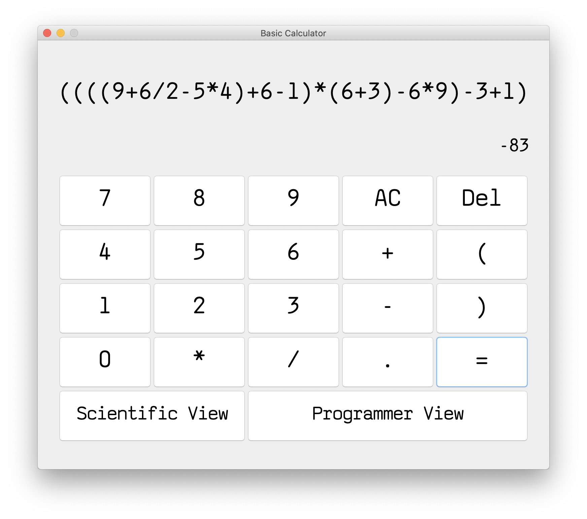

# BrilliantCalculator

> A calculator (Basic, Scientific, Programmer) built with java using swing-gui framework


## Built With
* [Swing-GUI]()
## Prerequisites

- Install java :
> On MAC OS using [Homebrew](https://brew.sh/) :
```shell
brew install 
```
> On Linux (Ubuntu) :
```shell
sudo apt-get install 
```
> On Windows using [Chocolatey](https://chocolatey.org/) :
```shell
choco install 
```
## Screenshots




## Contributing

Contributions are what make the open source community such an amazing place to be learn, inspire, and create. Any contributions you make are **greatly appreciated**.

1. Fork the Project
2. Create your Feature Branch (`git checkout -b feature/AmazingFeature`)
3. Commit your Changes (`git commit -m 'Add some AmazingFeature'`)
4. Push to the Branch (`git push origin feature/AmazingFeature`)
5. Open a Pull Request

## License
[Apache License 2.0](https://choosealicense.com/licenses/apache-2.0/)
## Contact
- Yassine Lafryhi - [@YassineLafryhi](https://twitter.com/YassineLafryhi) - [y.lafryhi@gmail.com](mailto:y.lafryhi@gmail.com)
- Project Link : [https://github.com/Yassine-Lafryhi/BrilliantCalculator](https://github.com/Yassine-Lafryhi/BrilliantCalculator)